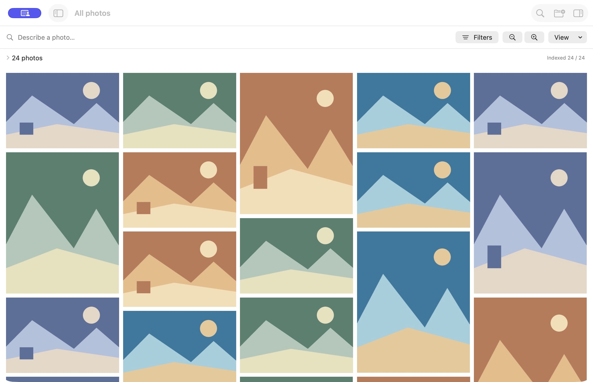
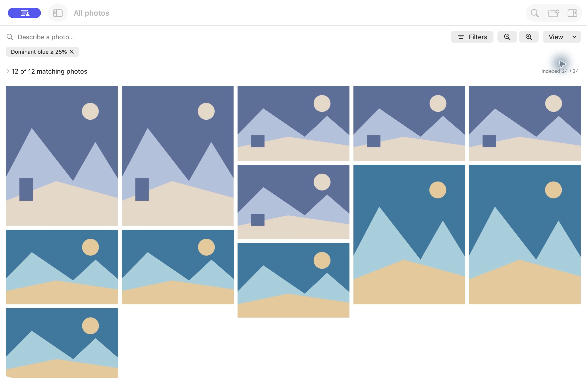

# Still

**Describe what you remember. Filter what you know. Group the results however you want.**

Still is a native macOS app for searching and organizing photos in existing folders and external drives. It combines local visual search with explicit metadata filters, live saved views, similar-photo search, dominant-color search and anonymous People groups. Originals stay in place and unchanged.

**Status:** research/hackathon prototype and local developer build. Python dependencies and pretrained weights are installed separately; this is not a notarized, standalone download. Broad accuracy and production model suitability remain unverified.



Still was previously named Photo Views. The bundle identifier, catalog/cache locations and `PHOTO_VIEWS_*` environment variables retain their existing names so existing libraries continue to work.

The public screenshots show the earlier interface and use original generated artwork, with no private photos or faces. They show the actual native app; the synthetic images are not retrieval-quality evidence.

## Features

- Recursive, resumable folder indexing with metadata, oriented previews and visible coverage/failures.
- Local natural-language visual search and reference-photo similarity using OpenCLIP.
- Filename/keyword search and exact camera, folder, date, lens, format, exposure, dimensions and confirmed-tag constraints.
- Saved live views, folder/month/camera/subject grouping, favorites and manual collections.
- Curated suggested tags with durable accept/reject/edit decisions.
- Dominant-color search with explicit minimum image-area coverage.
- Anonymous local face groups with merge, exclusion/restore and conservative refinement.
- Reversible RAW+JPEG association, per-file inspection and cached offline search.
- Full-proportion recycled AppKit gallery, incremental result loading, keyboard navigation, preview and persisted zoom.

## Requirements

- Apple Silicon Mac with Xcode command-line tools (`xcode-select --install` if absent).
- Python **3.12**, available as `python3.12`; install it from [Python](https://www.python.org/downloads/macos/) or your usual package manager.
- Network access for initial package/model downloads; baseline inference uses local files afterward.
- Several GiB of disk space for the Python runtime/dependencies, weights and image caches. CLIP weights alone are approximately 605 MB.

The package declares macOS 14+. Runtime verification so far is on macOS 26.6.2, Apple M5 Max, 48 GB; older systems and Intel Macs are not validated targets.

## Quickstart

```sh
git clone https://github.com/Domogo/photo-views.git
cd photo-views
python3.12 scripts/setup.py
python3 scripts/build_app.py --release --open
```

Setup creates `~/Library/Caches/PhotoViews/m0/venv`, installs pinned dependencies, downloads the exact CLIP snapshot and YuNet/SFace weights, verifies SHA-256 checksums and retains face-model licenses. It downloads software/models only. Rerunning setup reuses caches; `--skip-people` omits optional face dependencies/models.

In the app, choose **Add Folder…** (⌘O). Metadata and previews appear progressively; visual search becomes useful as embeddings complete. Use the coverage disclosure to pause/resume and inspect failures. Search describes visible content; press Return to apply mixed query clauses.

```text
cars at night
cars at night camera:"NIKON Z f" folder:Japan iso<=200 group by month
mostly blue
```

Use camera/folder values actually present in your catalog. Unsupported or ambiguous clauses show correction UI. Exact constraints are never silently broadened. Minimum match score is cosine similarity, not a confidence percentage.

**⌘F** focuses search; **Space** previews a photo; **⌘− / ⌘+** change gallery density; **⌘0** resets it. Select a photo for Details or Find Similar. People is in the optional sidebar.



## Setup options and troubleshooting

```sh
# Check an existing setup without network downloads.
python3.12 scripts/setup.py --verify-only

# Keep runtime/models in another directory outside the checkout.
python3.12 scripts/setup.py --root "$HOME/Library/Caches/PhotoViews/custom"
```

For a custom root, launch the executable directly so it inherits the environment:

```sh
PHOTO_VIEWS_PYTHON="$HOME/Library/Caches/PhotoViews/custom/venv/bin/python" \
PHOTO_VIEWS_MODEL="$HOME/Library/Caches/PhotoViews/custom/model" \
PHOTO_VIEWS_DATA_DIR="$HOME/Library/Application Support/Photo Views Demo" \
".build/app/Still.app/Contents/MacOS/PhotoViews"
```

The data override isolates the catalog and preview cache; People avatars/models derive from the model directory's parent. `open`/Finder launching may not inherit custom shell variables. Default-path setup needs no overrides.

If setup fails, retain its error output and rerun after correcting the cause. It refuses unsupported Python/platforms and roots inside the repository. Checksum failure means a model asset must be removed and fetched again. If inference is unavailable, filename/metadata browsing still works. The app itself does not download missing dependencies. See [detailed usage](docs/USAGE.md) and [PRIVACY.md](PRIVACY.md).

## How it works

SwiftUI/AppKit provide the native workspace; ImageIO produces local oriented sRGB previews and reads original metadata. SQLite persists the catalog and decisions. A versioned local JSON-lines Python worker uses OpenCLIP/PyTorch MPS for normalized 512-dimensional image/text embeddings and exact cosine retrieval, with lexical rank fusion. Exact eligibility comes before result selection. Palette analysis uses a coarse pixel-area histogram; separate YuNet/SFace models suggest anonymous People groups.

Saved views store recipes and gain newly indexed matches. Collections store explicit membership. Grouping changes presentation and never moves originals. Cached metadata/embeddings and available previews continue working when a drive is disconnected.

## Validation and limits

Local catalog/indexing checks, 25 worker checks and a release build pass on the development Mac. Prior native integration exercised disposable-volume disconnect/restart/changed-path remount and live saved-view updates. Actual RAW fixture evidence covers **Sony ILCE-6000 ARW and Nikon Z f NEF**, plus Nikon JPEGs; it is not blanket camera compatibility.

Small exploratory retrieval timings and hits are documented in [SUMMARY.md](SUMMARY.md). They are not representative human-held-out accuracy or full-archive P95 claims. Face grouping, tag thresholds, similarity cutoffs and similar-shot heuristics remain provisional. Naming, identity-aware query clauses, comprehensive split/recluster, complete accessibility verification and standalone packaging remain follow-ups.

The CLIP model card lists deployed use as out of scope. This project's code license and model suitability are separate; read [THIRD_PARTY_NOTICES.md](THIRD_PARTY_NOTICES.md) before reuse or distribution.

## Development and documentation

```sh
swift run CatalogChecks
swift run IndexChecks
"$HOME/Library/Caches/PhotoViews/m0/venv/bin/python" scripts/search/checks.py
python3 scripts/build_app.py --release
```

All checks/builds run locally. GitHub stores code; no GitHub Actions, hosting or paid automation is configured.

- [Project summary and technical explanation](SUMMARY.md)
- [Product requirements](prd.md), [product context](PRODUCT.md), [design](DESIGN.md), [milestones](IMPLEMENTATION_MILESTONES.md)
- [Historical implementation/evidence notes](docs/history/), [public-release preparation](docs/PUBLIC_RELEASE.md)
- [Contributing](CONTRIBUTING.md), [security reporting](SECURITY.md), [local data/privacy](PRIVACY.md)

Photo Views code and original demo artwork are **MIT licensed**. Separately downloaded dependencies/models retain their upstream terms; see [LICENSE](LICENSE) and [THIRD_PARTY_NOTICES.md](THIRD_PARTY_NOTICES.md).
