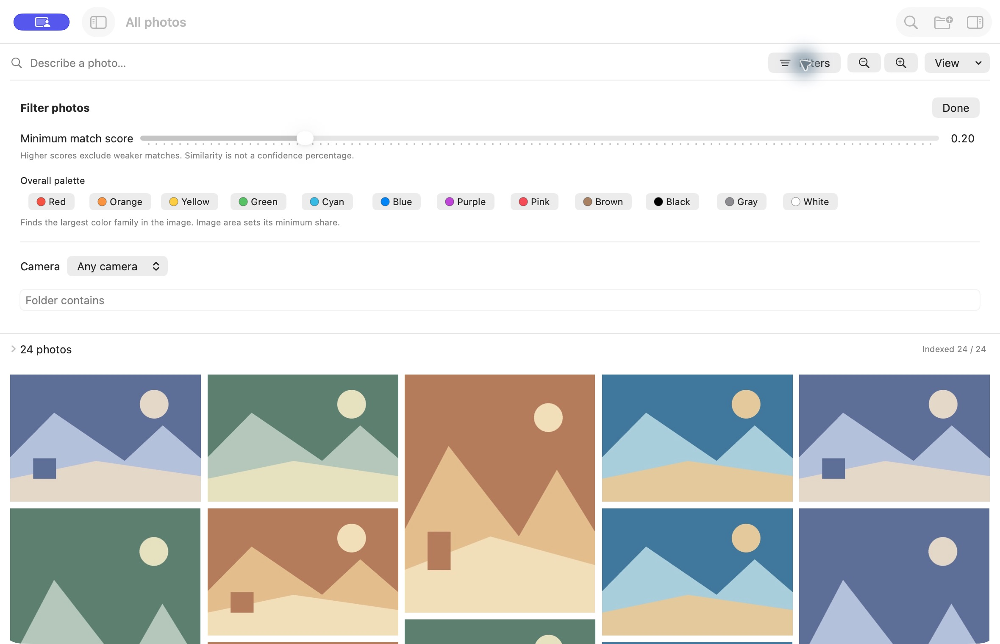

# Photo Views — hackathon demo guide

Prepared for **5 October 2026**. This summarizes the implemented prototype, its development process, and recorded local verification. Measurements below come from earlier project checkpoints; they are not a new benchmark run today.

## The 30-second pitch

> Photo Views helps you find photos in the folders and external drives you already own. Describe what you remember, filter what you know, and save the result as a live view. Visual search, similar-photo search, color search, and anonymous People groups run locally on your Mac. Your original photos stay where they are, untouched—even RAW files.

The motivating problem is a large personal archive: filenames rarely describe what is in a photo, folders provide only one way to organize it, and RAW files on an external drive are awkward to browse. Photo Views puts visual memory and camera metadata into the same native workspace.

**The core product promise:** “Describe what you remember. Filter what you know. Group the results however you want.”

## App images

These are real native app captures using original, procedurally generated landscape artwork. They demonstrate the gallery and controls without publishing private archive photos, faces or metadata. The artwork is covered by the repository MIT license. It is synthetic demo content, not evidence of photographic retrieval quality or RAW compatibility.





Private People, RAW and offline review captures remain excluded from Git. Their recorded verification is described below and in the milestone notes.

## What we built

| Area | Implemented behavior |
| --- | --- |
| Existing folders | Native folder selection, recursive discovery, persistent source access, metadata-first indexing, progress, pause/resume and individual failures. |
| RAW and previews | ImageIO reads original metadata and creates oriented sRGB derivatives. Real Sony ARW, Nikon NEF and Nikon JPEG fixtures were exercised. |
| Visual retrieval | Natural-language descriptions and reference-image similarity over local, versioned image embeddings. |
| Keyword retrieval | Literal filename/folder-path and tag matching, including current unconfirmed suggestions. A dedicated filename/keyword mode works without embeddings. |
| Exact filters | Sources, camera, folder, capture dates, lens, format, ISO, aperture, shutter duration, dimensions and confirmed tags; favorites/collections/person scope can also constrain membership. |
| Views and grouping | Folder, month, camera and primary subject; saved live recipes, changed-state indication, update/revert and refresh. |
| Organization | Accept/reject/edit suggested tags, manual tags, Favorites and explicit manual collections. Decisions survive restart and reindexing. |
| Palette | Local dominant-color histograms, named color families, minimum image-area coverage and saved palette rules. |
| RAW+JPEG | Conservative reversible association, collapsed browsing, per-file inspector/member selection, Separate Pair and Restore Automatic Pairs. |
| Offline recovery | Cached metadata, previews and embeddings remain useful; reconnection safely rescans using volume identity. |
| Gallery | Recycled AppKit masonry cells, full proportions, incremental result loading, spatial arrow navigation, Space preview and seven persisted zoom steps. |
| Similar shots | Provisional embedding-plus-preview-hash grouping keeps near-identical results adjacent. Every photo remains selectable. |
| People | Offline face detection/embeddings, anonymous avatars, incremental scanning, pause/resume, manual merges, exclusion/restore and conservative Refine Groups. |
| Editor handoff | Right-click opens the selected original in installed Photomator, Lightroom or Lightroom Classic. Availability and RAW/JPEG member selection are respected. |

## Models and local analysis

### Visual search: OpenCLIP ViT-B/32

The implemented checkpoint is **LAION CLIP-ViT-B-32-laion2B-s34B-b79K**, pinned to snapshot `1a25a446712ba5ee05982a381eed697ef9b435cf`. The worker validates its provenance and pinned runtime: `open-clip-torch==3.3.0`, `torch==2.14.1`.

OpenCLIP has an image encoder and a text encoder. Both produce **normalized 512-dimensional vectors**. Nearby vectors indicate related visual/text content. Image vectors are computed from cached derivatives and stored as Float32 blobs in SQLite; a text query requires only a new text vector and comparison with eligible cached image vectors.

Inference uses PyTorch **MPS on Apple Silicon**, falling back to CPU when unavailable. The checkpoint's preprocessing configuration and matching tokenizer are used. After setup/downloads, inference loads local weights with offline flags. The app does not upload images or queries or download weights during search.

This is pretrained-model integration; we did not train a new visual foundation model. The repository records MIT licensing for the checkpoint and separate OpenCLIP software licensing, alongside model-card deployment limitations. Production suitability remains a follow-up decision; see [M0_STATUS.md](docs/history/M0_STATUS.md).

### Suggested subjects: reuse the visual embeddings

The curated vocabulary is **people, animals, cars, buildings, food, mountains, water and vegetation**. Each subject has three text prompts. Their encoded vectors are averaged and normalized, then compared with existing image vectors. Independent per-tag cutoffs determine eligibility; at most three suggestions are retained.

No extra captioning model is required. Scores are cosine similarity, not independent tag probabilities. Local calibration was exploratory and agent-reviewed; broad human-held-out precision remains unverified. Suggestions are visibly distinct from confirmed tags, and persisted user rejection prevents reindexing from undoing corrections.

### People: YuNet + SFace

Whole-image CLIP vectors are not used to recognize a person. The People pipeline uses **OpenCV YuNet (2023mar)** for face detection and **SFace (2021dec)** for normalized **128-dimensional face descriptors**. Setup pins OpenCV Zoo revision `47534e27c9851bb1128ccc0102f1145e27f23f98`, verifies model checksums, and uses `opencv-python-headless==4.11.0.86`; the pinned YuNet license is MIT and SFace is Apache 2.0.

Detection operates on cached previews with detection score ≥ **0.9** and faces at least **32 pixels**. Automatic matching uses group averages plus member support, provisional cosine threshold **0.50**, and a **0.04** ambiguity margin. Distinct faces in one photo cannot join the same suggested group.

Refine Groups conservatively consolidates existing groups using centroid similarity ≥ **0.65**, cross-match similarity ≥ **0.60** with evidence from at least two logical photos on each side, and complete-link checks to prevent transitive merging. Single-photo groups require ≥ **0.85** centroid similarity. Shared-image detections and explicit exclusions block automatic merges; RAW/JPEG pairs count once as evidence.

A dedicated serialized worker processes four-preview batches independently of the search worker. Anonymous IDs, descriptors, fingerprints, merges and exclusions persist locally. Small/profile/occluded faces may be missed, and identities can still split or be confused. Names and identity-aware natural-language clauses are not implemented.

### Palette: deterministic image analysis

Palette search uses **no neural model**. Pillow analyzes orientation-corrected sRGB previews at **64×64**, classifying pixel area into twelve named HSV color families. Results use the version `srgb-hsv-area-v1` and persist with file/pipeline fingerprints.

A chosen color must be a largest family and meet the minimum area, **25% by default**, adjustable in the UI from 5–100%. “Mostly blue” is this explicit rule, not necessarily more than half the pixels. It does not identify the color of a particular object. Cached palettes survive preview eviction and disconnected originals.

### Query interpretation and explored alternatives

The shipped interpreter is a **bounded deterministic Swift grammar**, not an LLM. It extracts supported camera/folder/date/tag/metadata/palette/grouping clauses into a typed editable plan. Ambiguous cameras and unsupported directives block execution for correction; code constructs parameterized constraints. Model output never becomes arbitrary SQL or file operations.

DSPy optimization and optional Jev decisions/reranking were investigated in the PRD but are **not implemented in the demo**. Core ML is a future deployment option. MobileCLIP was considered but not adopted; the PRD records licensing concerns for its weights. The local OpenCLIP baseline allowed us to demonstrate the product without hosted inference or paid API dependencies.

## How searching and filtering work

The distinction to emphasize is **visual relevance + exact eligibility + presentation**.

1. **Interpret the input.** Plain descriptions use debounced visual retrieval. Supported mixed queries apply on Return and produce removable constraints. `blue car` remains visual text; `mostly blue` becomes a palette rule.
2. **Select eligible assets.** Parameterized SQLite constraints intersect source/organization scope and metadata rules before ranking. Camera/lens/format are exact values; folder matching is a case-insensitive path substring. Active date boundaries include both endpoint days and use the camera's recorded calendar day; missing required metadata does not pass its constraint. Every requested confirmed tag must match.
3. **Apply palette eligibility when requested.** Missing, failed or stale palette records do not silently match. Partial coverage stays visible.
4. **Rank visual candidates.** Compare the normalized query vector with eligible image vectors using the dot product—equivalent to cosine similarity. This is exact comparison over the candidate matrix, not an approximate-nearest-neighbor service. Default Minimum match score is **0.20 for text** and **0.75 for a reference image**; both are provisional, adjustable cutoffs, not calibrated probabilities.
5. **Combine evidence by rank.** Text visual search uses reciprocal-rank fusion with `k=60`: each list contributes `1 / (60 + rank)`. Literal filename/path/tag matches can boost visually eligible candidates; lexical matches cannot bypass the visual cutoff. Filename/keyword mode uses lexical matching directly. Reference-image search uses visual ranking and excludes the reference; collapsed mode also excludes its paired sibling. Palette combined with a query can contribute another rank list without restoring excluded candidates.
6. **Collapse qualifying RAW+JPEG pairs.** Each file passes filters and ranking first. The first qualifying member represents the logical photo; its sibling cannot bypass format, tag or collection constraints. Collapse happens before pagination.
7. **Arrange and display.** Near-identical search results are kept adjacent using cosine similarity ≥ **0.92** plus 64-bit preview difference-hash distance ≤ **20**. Low-contrast previews are excluded from hash grouping. Explicit month/camera/subject grouping remains available and changes order, not membership or files. Missing grouping metadata belongs to Unknown.
8. **Load more.** The gallery starts with **500** results and requests 500 more near the end. A page boundary extends to include an entire similar-shot group. The status distinguishes loaded photos, total qualifying logical photos and indexing coverage.

An empty result remains empty: the app never broadens exact filters behind the user's back. Semantic similarity is fallible, so a candidate meeting the cutoff is not a guarantee that the description is true.

### Saved views versus collections

A saved view stores **sources + query + filters + grouping + sorting**, plus relevant reference/model/ranking/palette/cutoff/pair settings. It is a live recipe: newly indexed qualifying assets appear without manually adding them. Model/version incompatibility is exposed rather than silently changing the saved recipe. Update View and Revert Changes make edits explicit.

A collection stores chosen members. Favorites and tags are catalog decisions. None of these operations moves files or writes metadata into originals.

## Architecture and reliability

```text
Existing folders / external drive (originals read-only)
    ↓ native discovery + ImageIO metadata/preview pipeline
Local SQLite catalog + bounded derivative caches
    ├─ SwiftUI workspace + recycled AppKit gallery
    ├─ local JSON-lines search worker → OpenCLIP / lexical / palette
    └─ separate local People worker → YuNet / SFace
```

SwiftUI handles the native workspace and controls; AppKit handles the large recycled gallery. SQLite stores sources/assets, metadata, job checkpoints, embeddings, tags, recipes, collections, pairing and People records. A versioned stdin/stdout JSON-lines bridge validates responses and request identities, rejects stale query results, and keeps inference off the UI thread. There is no browser UI or HTTP decision server in the baseline.

Indexing proceeds in stages so metadata and browsing can become useful before all visual work finishes. Visual batches checkpoint completed vectors, preserve work across pause/restart and isolate failures. Source volume UUID plus relative paths supports mount-path recovery; per-source inode identities stabilize asset IDs. A disconnected drive is not treated as deletion. File fingerprints and pipeline/model versions govern reuse.

The preview disk budget is **2 GiB**. Gallery decoding runs in at most four background operations with 512px thumbnails, cancellation on cell reuse and a **64 MiB / 256-image** memory cache. Cache eviction can remove offline imagery while retaining metadata and embeddings; an uncached preview needs the source reconnected.

The package declares macOS 14; runtime evidence is on the development Mac, **MacBook Pro M5 Max, 48 GB, macOS 26.6.2**. This is an ad-hoc signed developer build using an external Python environment and downloaded model assets, not a self-contained distributable.

## The process behind the work

The repository records development across 2–3 October, followed by this demo summary. We worked from requirements and feasibility into vertical slices, with code, local checks, native interaction review and status documentation at each stage.

| Stage | Work and reason |
| --- | --- |
| Product/design planning | Established the folder/external-drive use case, preservation of originals, required RAW scope, local baseline and Photo Workbench direction. Documented competitor/reference learnings and separated requirements from targets. |
| M0: feasibility | Probed actual Sony/Nikon files before committing to decoder support. Generated previews, checked original hashes and evaluated a pinned local image/text model on a small retrieval sample. |
| M1: foundation | Built the native shell, folder access and persistent catalog. |
| M2: indexing/browsing | Added metadata, RAW previews, durable jobs, pause/restart, cached browsing, preview and failure recovery. |
| M3: retrieval | Connected the persistent Python worker, visual/reference search, lexical evidence and exact constraints; tested offline inference and killed-worker recovery. |
| M4: live views | Added deterministic grouping and saved recipes, including update/revert and membership changes as indexing progresses. |
| M5: organization | Added subject suggestions, explicit human correction, favorites and manual collections, preserving decisions during reindexing. |
| M6: mixed queries | Expanded metadata filters and introduced a bounded editable interpreter rather than trusting free-form generated constraints. |
| M7: integrity/recovery | Added reversible RAW/JPEG associations and tested disconnection/restart/remount recovery on a disposable APFS volume. |
| Canvas revision | Followed the user's preference for a quieter image-first workspace: optional panes, expandable filters, full proportions, palette search and continuous gallery. |
| Performance and polish | Diagnosed deep scrolling, replaced nested SwiftUI layout with recycled AppKit cells, then added adjustable cutoffs, incremental search loading, scroll reset, editor handoff, similar-shot adjacency and persistent zoom. |
| People extension | Added local face models, anonymous grouping and correction controls, then aggregate matching and conservative refinement after observed identity fragmentation. |

A useful engineering story: a deep-scroll hang showed **100% CPU in SwiftUI/AttributeGraph layout**, with about 108 MiB memory. That pointed to layout feedback. Moving to deterministic masonry frames and recycled `NSCollectionView` cells corrected the observed hang. A subsequent native session scrolled through 3,416 logical photos; the app returned to 0% idle CPU at about 258 MiB RSS. This is a measured session, not a universal frame-rate claim.

Another useful story: the first changed-path remount exposed unstable opaque Foundation file identifiers. Switching to per-volume inode identities preserved asset IDs, embedding hashes, derivative times, saved recipes and manual decisions in the repeated test.

The workflow combined implementation with synthetic invariants, real read-only fixtures, local native captures and bounded design reviews. Git history tracks verified logical increments. GitHub is private code storage only; no custom Actions, builds, hosting, CI/CD or paid services were added. Fixtures, weights, catalogs, caches, credentials and generated probe reports stay outside version control.

## Evidence we can quote accurately

| Recorded evidence | What it establishes |
| --- | --- |
| 60 originals: 20 Sony ILCE-6000 ARW, 20 Nikon Z f NEF, 20 Nikon JPEG; all previews generated and original hashes matched. | Feasibility on these actual fixtures; not blanket RAW compatibility. |
| Initial model load 1.39 s; 60 embeddings 1.43 s; exploratory query P95 0.081 s. | Fast execution on a small sample on this Mac; not whole-archive P95. |
| Nine exploratory queries had a relevant top-ten hit under agent-authored labels. | Promising retrieval; not a representative human-held-out accuracy result. |
| Documented archive checkpoint: 19,877 discovered files, 5,085 completed visual embeddings/previews, 3,416 preview-ready logical photos after pair collapsing. | A real archive was connected; indexed coverage was partial. These are checkpoint counts, not today's live inventory. |
| 5,085 palette previews analyzed in 29.549 s; one palette-only query took 0.1037 s. | Bounded local throughput/latency sample; not P95 or perceptual-quality validation. |
| Six user-approved query examples and 24 additional authored interpretation cases passed. | Supported grammar examples worked; not the PRD's broad interpretation target. |
| Native disposable APFS unmount/restart/changed-path remount passed; a new matching photo appeared in an unchanged saved view. | Actual offline/recovery/live-membership integration on the test volume; the user's SSD was not removed. |
| Latest documented People checks: 22 local worker checks; native exclusion/restore changed a group from 11 → 10 → 11 photos. | Persistence/correction behavior; not recognition accuracy across the archive. |
| Local CatalogChecks, IndexChecks, worker checks and release builds recorded as passing across milestones. | Implementation invariants and bounded integration evidence; broad accessibility/relevance gates remain separate. |

The PRD's ≥80% held-out top-ten retrieval hit rate, ≥90% interpretation agreement, ≥90% suggested-tag precision and sub-second full-demo P95 are **targets**, not established results. M8 verification and production handoff remain open.

## Demo preparation and recovery

1. Open the existing app and indexed source; confirm useful results for `cars at night`, an available camera constraint, `mostly blue` and an existing People group.
2. Keep the coverage disclosure available and describe partial indexing honestly. People may begin/resume scanning on entry; use existing groups rather than waiting for a complete scan.
3. Use **⌘F** for search, **Space** for preview, **⌘− / ⌘+** for gallery zoom and **⌘0** to reset. **Exit Similar** leaves reference mode; Clear Filters removes exact constraints. Clear visual text separately if needed.
4. Save a view before showing another workflow. A saved view and a manual collection demonstrate different concepts.
5. For the offline story, use the recorded recovery evidence in the milestone notes or a disposable test source. The prior physical integration test used a disposable APFS volume.
6. If the worker setup is missing, filename browsing remains a useful fallback. A missing external runtime/weights prevents visual or face inference; do not initiate a model download during the presentation.


### Local build and checks

```sh
# Build and open the native developer app.
python3 scripts/build_app.py --release --open

# Run the native checks when verifying code changes.
swift run CatalogChecks
swift run IndexChecks

# Run local worker checks with the configured runtime.
"${PHOTO_VIEWS_PYTHON:-$HOME/Library/Caches/PhotoViews/m0/venv/bin/python}" scripts/search/checks.py

# One-time People dependency/model setup, if not already prepared.
python3 scripts/search/setup_people.py
```

The app is generated at `.build/app/Photo Views.app`. The default catalog is `~/Library/Application Support/Photo Views/catalog.sqlite`; `PHOTO_VIEWS_DATA_DIR` supports isolated checks. Preview caches normally live under `~/Library/Caches/PhotoViews/previews`. The search runtime/model default to `~/Library/Caches/PhotoViews/m0/{venv,model}`; `PHOTO_VIEWS_PYTHON` and `PHOTO_VIEWS_MODEL` override them. See [README.md](README.md) and [M0 setup](spikes/m0/README.md) for reproduction.

## Questions likely to come up

**Does it upload my photos?** Baseline search, tagging, palette and People analysis run locally. Setup downloads software/weights; inference does not send images or queries to a provider.

**Is this an LLM?** Visual retrieval uses a paired image/text embedding model. Faces use separate detection/recognition models. Palette and query grammar are deterministic code. No hosted generative model is needed for the demo.

**Why a Python worker in a native app?** It reduced model-conversion risk and let us validate retrieval quickly with the actual checkpoint. Native SwiftUI/AppKit still owns the application. Standalone packaging or validated Core ML conversion is follow-up work.

**Does grouping reorganize my folders?** It only changes result presentation. Saved views store rules; collections store memberships. Originals never move or change.

**Does it support all RAW cameras?** Evidence currently covers Sony ILCE-6000 ARW and Nikon Z f NEF fixtures. Other cameras and variants need actual files and validation.

**Are the People groups reliable identities?** They are anonymous suggestions with correction tools. Broad recognition accuracy, naming and comprehensive split/recluster remain follow-ups.

**What would you do next?** Finish human-labeled event-separated retrieval/tag/People evaluation, measure cold/warm latency at full coverage, broaden RAW fixtures, complete accessibility checks and package a reproducible standalone runtime. These matter more than adding an unmeasured hosted reranker.

## Source map

- Product and scope: [prd.md](prd.md), [PRODUCT.md](PRODUCT.md), [IMPLEMENTATION_MILESTONES.md](IMPLEMENTATION_MILESTONES.md).
- Native design and revision evidence: [DESIGN.md](DESIGN.md), [UX_PLAN.md](docs/history/UX_PLAN.md), [CANVAS_STATUS.md](docs/history/CANVAS_STATUS.md), [.impeccable/surfaces/main-workspace.md](.impeccable/surfaces/main-workspace.md).
- Milestone details: [M0](docs/history/M0_STATUS.md), [M1](docs/history/M1_STATUS.md), [M2](docs/history/M2_STATUS.md), [M3](docs/history/M3_STATUS.md), [M4](docs/history/M4_STATUS.md), [M5](docs/history/M5_STATUS.md), [M6](docs/history/M6_STATUS.md), [M7](docs/history/M7_STATUS.md).
- Search/ranking: [worker.py](scripts/search/worker.py), [QueryPlan.swift](Sources/PhotoViewsCore/QueryPlan.swift), [SearchBridge.swift](Sources/PhotoViewsApp/SearchBridge.swift).
- Local analysis: [tag_vocabulary.json](scripts/search/tag_vocabulary.json), [palette.py](scripts/search/palette.py), [people.py](scripts/search/people.py).
- Catalog/indexing/gallery: [Catalog.swift](Sources/PhotoViewsCore/Catalog.swift), [IndexCoordinator.swift](Sources/PhotoViewsCore/IndexCoordinator.swift), [NativePhotoGallery.swift](Sources/PhotoViewsApp/NativePhotoGallery.swift).
